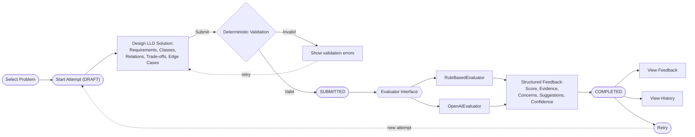
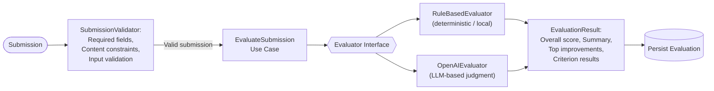
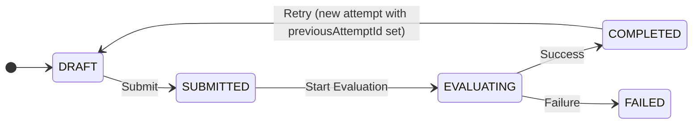
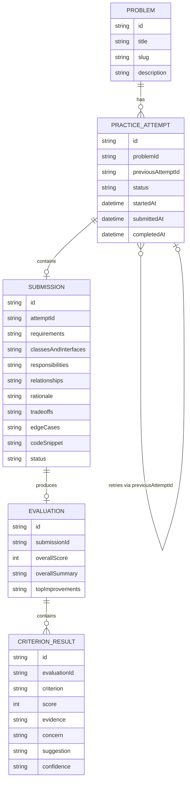
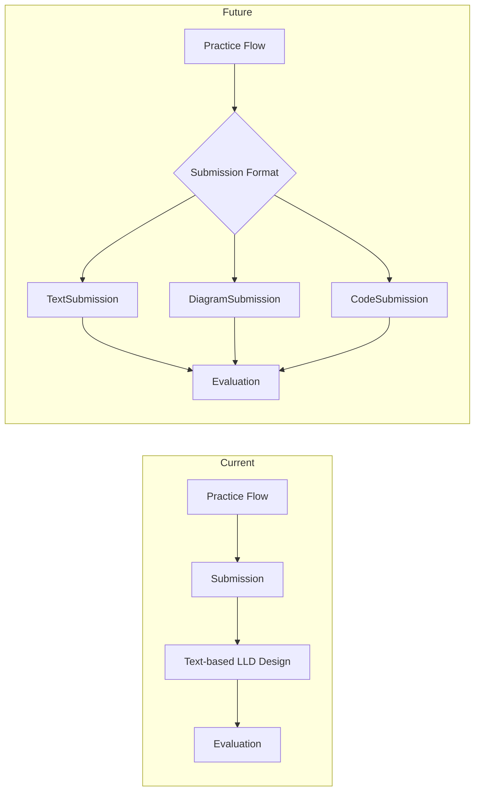
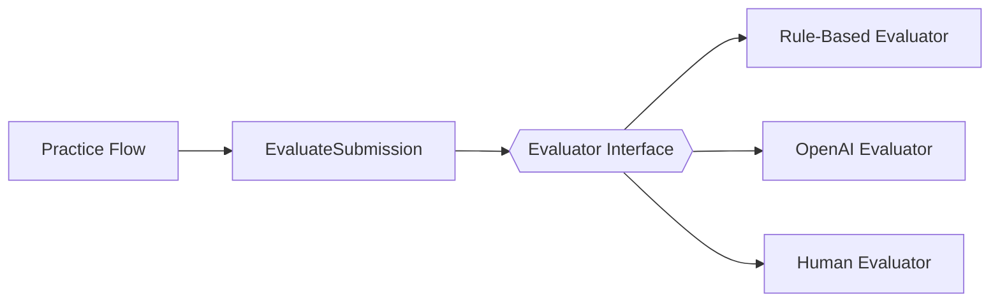

# LLD Practice Platform

A feedback-first platform for practicing Low-Level Design problems.

The platform lets a learner:

1. Choose an LLD problem
2. Start a practice attempt
3. Submit a structured design
4. Receive criterion-level feedback
5. Retry the problem
6. Compare previous attempts through history

The core product idea is simple:

> Practice → Submit → Get feedback → Improve → Retry

---

## Why this exists

Most LLD preparation focuses heavily on reading solutions or memorizing design patterns.

This platform focuses on the learner's own design process.

The goal is to make feedback part of the practice loop rather than treating it as an afterthought.

The current MVP intentionally focuses on a small set of problems and a single end-to-end practice flow.

---

## Current problems

The MVP contains four LLD problems:

- Vending Machine
- Parking Lot
- Library Management
- Elevator System

Each problem provides context that the learner uses to create their own design.

---

## Architecture

The application is intentionally implemented as a simple monolith. HTTP routes delegate to application use cases, which coordinate domain behavior, repositories, and evaluation. Infrastructure details such as PostgreSQL and evaluator implementations remain behind interfaces.

```mermaid
flowchart LR
    subgraph FE[React Frontend]
        F1[Problems]
        F2[Practice]
        F3[Feedback]
        F4[History]
    end

    subgraph API[Express REST API]
        R1[Problem Routes]
        R2[Attempt Routes]
    end

    subgraph APP[Application Layer]
        A1[CreateAttempt]
        A2[SubmitAttempt]
        A3[EvaluateSubmission]
        A4[RetryAttempt]
        A5[GetProblemHistory]
    end

    subgraph DOM[Domain Layer]
        D1[PracticeAttempt]
        D2[Submission]
        D3[Domain Rules]
        D4[State Transitions]
    end

    subgraph EVAL[Evaluator]
        E0{{Evaluator Interface}}
        E1[RuleBasedEvaluator]
        E2[OpenAIEvaluator - optional]
        E0 --> E1
        E0 --> E2
    end

    subgraph REPO[Repository Interfaces]
        RP1[ProblemRepository]
        RP2[AttemptRepository]
        RP3[SubmissionRepository]
        RP4[EvaluationRepository]
    end

    subgraph DB[PostgreSQL]
        DB1[(Problem)]
        DB2[(PracticeAttempt)]
        DB3[(Submission)]
        DB4[(Evaluation)]
        DB5[(CriterionResult)]
    end

    FE -- HTTP / JSON --> API
    API --> APP
    APP --> DOM
    APP --> EVAL
    DOM --> REPO
    REPO --> DB
```



**Figure 1 — High-level architecture.** The MVP uses a simple layered monolith. HTTP routes delegate to application use cases, which coordinate domain behavior, repositories, and evaluation. Infrastructure details such as PostgreSQL and evaluator implementations remain behind interfaces.

### Backend structure

```text
apps/api/src/

domain/
  entities/
  enums/
  errors/
  interfaces/

application/
  services/
  use-cases/

infrastructure/
  database/
  evaluators/
  repositories/

routes/
config/
```

The domain layer owns business behavior and state transitions.

Application use cases coordinate workflows.

Repositories abstract persistence.

Evaluators abstract submission evaluation.

---

## Core flow

A learner selects a problem, creates an attempt, submits a structured LLD design, passes deterministic validation, receives structured evaluation feedback, and can review history or retry.



**Figure 2 — Core practice loop.** A learner selects a problem, creates an attempt, submits a structured LLD design, passes deterministic validation, receives structured evaluation feedback, and can review history or retry.

---

## Evaluation

The evaluator produces structured feedback across six criteria:

- Requirements
- Responsibilities
- Abstraction
- Coupling
- Extensibility
- Edge Cases

Each criterion contains:

- Score
- Evidence
- Concern
- Suggestion
- Confidence

The system also produces:

- Overall score
- Overall summary
- Top improvements

The current MVP uses a deterministic `RuleBasedEvaluator`.

An `OpenAIEvaluator` implementation is also kept behind the same evaluator interface so that an LLM-based evaluator can be introduced without changing the practice flow.

### Evaluation architecture

Deterministic validation is separated from judgment-heavy evaluation. The evaluator is defined behind an interface so the practice flow does not depend directly on a particular evaluation strategy. The current MVP runs with the rule-based evaluator while the OpenAI evaluator remains an optional, not-currently-active implementation (see [`AI_USAGE.md`](./AI_USAGE.md) for why).



**Figure 5 — Evaluation architecture.** Deterministic validation is separated from judgment-heavy evaluation. The evaluator is defined behind an interface so the practice flow does not depend directly on a particular evaluation strategy. The current MVP can run with the rule-based evaluator while the OpenAI evaluator remains an optional implementation.

> **Note:** the current development environment does not have available OpenAI API quota, so runtime evaluation uses `RuleBasedEvaluator` only. No fake AI-generated evaluation is ever shown to the user. See [`AI_USAGE.md`](./AI_USAGE.md) for details.

---

## Attempt lifecycle

Attempt state transitions are enforced by the domain entity. Evaluation failures move the attempt to `FAILED`, while retry creates a new attempt linked to the previous attempt instead of mutating the original submission.



**Figure 3 — Attempt lifecycle.** Attempt state transitions are enforced by the domain entity. Evaluation failures move the attempt to `FAILED`, while retry creates a new attempt linked to the previous attempt instead of mutating the original submission.

---

## Deterministic validation vs evaluation

The system separates structural validation from design judgment.

### Deterministic validation

The submission validator checks:

- Required fields
- Minimum content length
- Minimum word count
- Code snippet size
- Submission structure

The backend also enforces important workflow rules such as:

- An attempt cannot be submitted twice
- An evaluation is not duplicated
- Retry creates a separate attempt
- Attempt state transitions are enforced by the domain

### Evaluation

The evaluator focuses on design quality and produces structured feedback.

This separation means validation remains predictable while judgment-heavy evaluation can evolve independently.

---

## Domain model

A problem can have multiple practice attempts. Each attempt has at most one submission and one evaluation. Retry creates a new attempt linked to the previous attempt, preserving historical submissions and feedback.



**Figure 4 — Core domain model.** A problem can have multiple practice attempts. Each attempt has at most one submission and one evaluation. Retry creates a new attempt linked to the previous attempt, preserving historical submissions and feedback.

---

## Persistence

PostgreSQL stores:

- Problems
- Practice attempts
- Submissions
- Evaluations
- Criterion-level evaluation results

Evaluation results are stored rather than recomputed every time feedback is viewed.

This also allows attempt history to show how a learner's design changes across retries.

---

## Idempotency

Evaluation is protected against duplicate processing.

Before evaluating a submission, the application checks whether an evaluation already exists.

If one exists, the stored result is returned.

This prevents the same submission from generating multiple evaluation records.

---

## Failure handling

The evaluation workflow follows:

```text
SUBMITTED
    ↓
EVALUATING
    ↓
  success → COMPLETED
    │
 failure → FAILED
```

The submission is persisted before evaluation, so the practice flow does not depend on the evaluator completing successfully before the submission exists.

---

## Tech stack

### Frontend

- React
- TypeScript
- Vite

### Backend

- Node.js
- Express
- TypeScript
- Jest
- Supertest

### Database

- PostgreSQL
- Prisma

### Evaluation

- Deterministic rule-based evaluator
- Optional OpenAI evaluator behind an evaluator interface

---

## Running locally

### Prerequisites

- Node.js
- Docker
- npm

### Start PostgreSQL

From the repository root:

```bash
docker compose up -d
```

The PostgreSQL container runs on port 5433.

### Backend

```bash
cd apps/api
npm install
npx prisma migrate dev
npm run dev
```

Backend:

```text
http://localhost:5000
```

### Frontend

In another terminal:

```bash
cd apps/web
npm install
npm run dev
```

Frontend:

```text
http://localhost:5173
```

---

## Testing

Backend tests:

```bash
cd apps/api
npm test -- --runInBand
```

Current test coverage includes:

- Domain/application attempt flow
- Submission and evaluation flow
- Evaluation idempotency
- Retry behavior
- Rule-based evaluator behavior
- API routes
- Duplicate submission prevention
- History
- Validation failures

The MVP currently has 26 automated backend tests.

TypeScript verification:

```bash
npx tsc --noEmit
```

Frontend production build:

```bash
cd apps/web
npm run build
```

---

## Design decisions

### Simple monolith

The assignment is an LLD/domain-design exercise, so the application intentionally avoids unnecessary distributed architecture.

A modular monolith is sufficient for the current product.

### Evaluator interface

Evaluation is represented through an interface rather than being hard-coded into the practice flow.

This allows:

```text
Evaluator
   ├── RuleBasedEvaluator
   └── OpenAIEvaluator
```

A future human evaluator or another evaluation strategy can be introduced without rewriting the practice workflow.

### Stored evaluations

Evaluation results are persisted because feedback is part of the learner's history.

### Retry as a new attempt

Retrying creates a new attempt linked to the previous attempt.

This preserves the learner's progression rather than replacing historical work.

---

## Known limitations

The current MVP intentionally does not include:

- Authentication
- Multi-user profiles
- Real-time collaboration
- Diagram editing
- Production-scale asynchronous workers
- Distributed services
- Advanced analytics
- Runtime LLM evaluation in the current free local setup

These are outside the narrow MVP scope.

---

## Future extensions & extensibility (Change Tests)

The architecture leaves room for:

- Diagram-based submissions
- Human evaluation
- LLM-based evaluation
- Additional LLD problems
- Per-user progress
- More detailed comparison between attempts
- Additional deterministic checks

The practice flow should remain independent of the specific submission format and evaluator implementation. The two diagrams below walk through the change tests the architecture was designed against.

### Change Test A — New submission format

The practice flow is separated from the content format, allowing future diagram or code submissions without rewriting the core attempt lifecycle.



**Change Test A — Submission format extensibility.** The practice flow is separated from the content format, allowing future diagram or code submissions without rewriting the core attempt lifecycle.

### Change Test B — New evaluation strategy

Evaluation strategy can change independently of the practice flow. A rule-based evaluator can be replaced or complemented by an LLM or human evaluator through the evaluator interface.



**Change Test B — Evaluator extensibility.** Evaluation strategy can change independently of the practice flow. A rule-based evaluator can be replaced or complemented by an LLM or human evaluator through the evaluator interface.

---

## Project structure

```text
lld-practice-platform/
├── apps/
│   ├── api/
│   │   ├── src/
│   │   ├── tests/
│   │   └── prisma/
│   │
│   └── web/
│       └── src/
│
├── docs/
│   ├── research-note.md
│   └── design-note.md
│
├── AI_USAGE.md
├── README.md
└── docker-compose.yml
```

---

## Assignment focus

The MVP prioritizes:

- Product thinking
- Clean domain modeling
- Explicit responsibilities
- Extensible evaluator boundaries
- Useful structured feedback
- Attempt history
- Testing important behavior
- Thoughtful use of AI

The implementation deliberately avoids adding infrastructure complexity that does not contribute to the core learning loop.