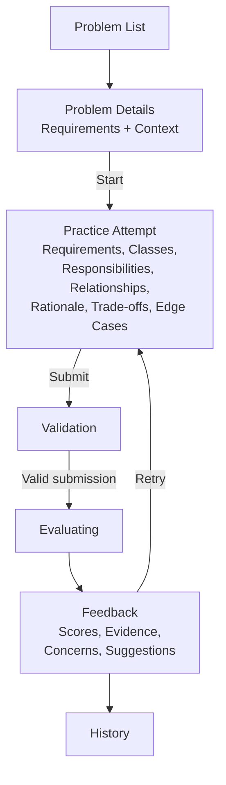
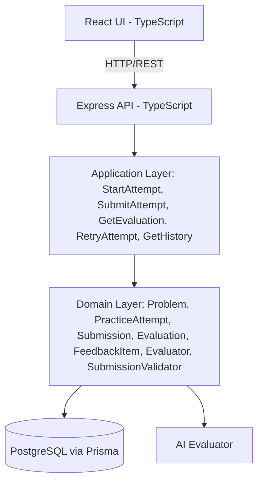
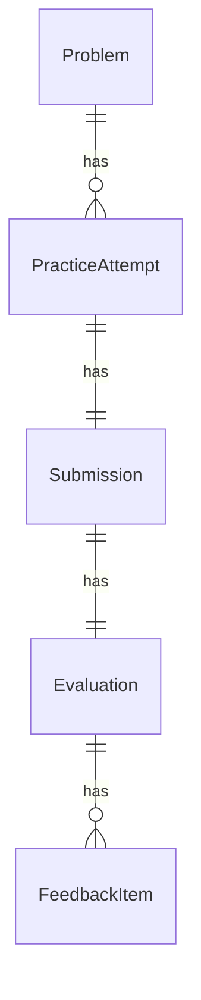
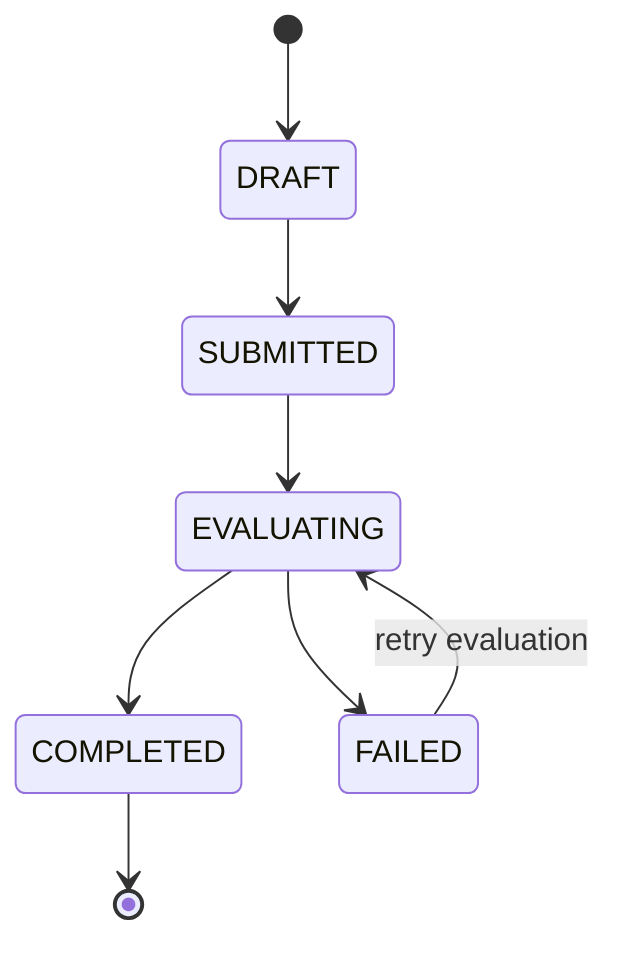
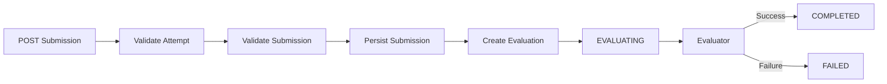
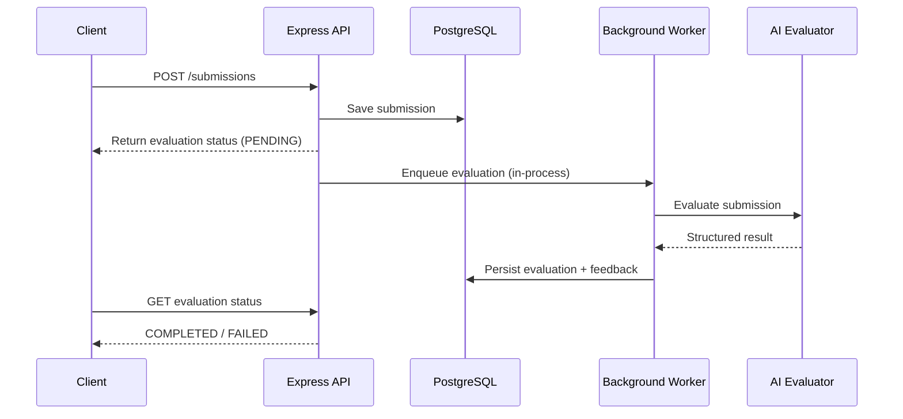
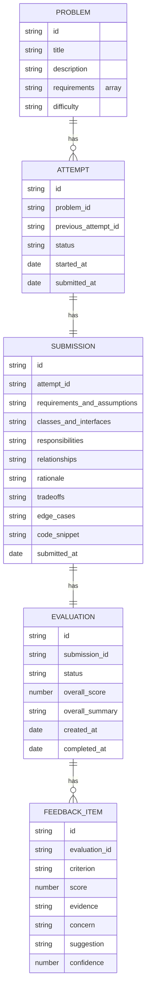

# LLD Practice Platform — Design Note (MVP)

## 1. Overview

**Problem:** Most LLD prep focuses on consuming problem statements and reference solutions. The harder part is knowing whether *your own* design is good, why it's weak, and what to improve next.

**Approach:** A feedback-first practice loop:

```
Choose → Design → Submit → Evaluate → Understand → Improve → Retry
```

The MVP evaluates a learner's LLD submission against a fixed rubric and returns structured, evidence-backed feedback — not just a score.

## 2. MVP Goals

A learner should be able to:

- Select an LLD problem, read requirements/context
- Start an attempt and submit a structured design
- Get deterministic validation, then AI evaluation
- Receive criterion-level feedback
- Retry the problem and compare past attempts

**MVP problems:**

| Problem | Learning focus |
|---|---|
| Vending Machine | State and responsibility |
| Parking Lot | Relationships and extensibility |
| Library Management | Responsibilities and policies |
| Elevator System | State and interaction complexity |

## 3. User Flow



**Key decision:** submission is saved *before* evaluation begins, so a slow/failed evaluator never loses the learner's work.

## 4. Architecture — Modular Monolith



**Why modular monolith:** clear domain boundaries, simple dev/deploy, low ops overhead — while still allowing extraction later (evaluation is the natural first piece to pull out).

## 5. Domain Model



An attempt can also reference a `previousAttemptId` pointing to an earlier attempt, forming a history chain across retries (self-reference, not shown above).

## 6. Core Domain Classes

```ts
class Problem {
  id: string;
  title: string;
  description: string;
  requirements: string[];
  difficulty: Difficulty;
}
```
Owns problem context/requirements/difficulty. Does not evaluate submissions.

```ts
class PracticeAttempt {
  id: string;
  problemId: string;
  previousAttemptId?: string;
  status: AttemptStatus; // DRAFT | SUBMITTED | EVALUATING | COMPLETED | FAILED
  startedAt: Date;
  submittedAt?: Date;
}
```
Controls the attempt lifecycle. No AI-specific logic.



## 7. Submission Model (structured text)

```ts
class Submission {
  id: string;
  attemptId: string;
  requirementsAndAssumptions: string;
  classesAndInterfaces: string;
  responsibilities: string;
  relationships: string;
  rationale: string;
  tradeoffs: string;
  edgeCases: string;
  codeSnippet?: string; // optional, not executed
  submittedAt: Date;
}
```
Structured text gives enough evidence for evaluation without the cost of a full UML editor. Optional code shows implementation thinking but is never executed — keeps focus on design quality, not code judging.

## 8. Submission Validation (deterministic, pre-AI)

```ts
interface SubmissionValidator {
  validate(submission: Submission): ValidationResult;
}
interface ValidationResult { valid: boolean; errors: string[]; }
```

Checks: required sections exist & non-empty, min/max size, valid attempt state, duplicate submission, basic malformed input.

This separates *"is it valid enough to evaluate?"* from *"how good is the design?"* — deterministic checks handle the former, AI handles the latter.

## 9. Evaluation Domain

```ts
class Evaluation {
  id: string;
  submissionId: string;
  status: EvaluationStatus; // PENDING | EVALUATING | COMPLETED | FAILED
  overallScore?: number;
  overallSummary?: string;
  createdAt: Date;
  completedAt?: Date;
}
```

## 10. Feedback Model

```ts
class FeedbackItem {
  id: string;
  evaluationId: string;
  criterion: EvaluationCriterion;
  score: number;
  evidence: string;
  concern: string;
  suggestion: string;
  confidence: number;
}
```
Turns "your design is 6/10" into: **Evidence** (what worked) → **Concern** (what's weak) → **Suggestion** (what to change) → **Confidence** (how certain the evaluator is).

## 11. Evaluation Rubric — 6 dimensions

| Criterion | Evaluates |
|---|---|
| Requirements | Understanding of functional requirements & assumptions |
| Responsibilities | Whether classes have clear, cohesive responsibilities |
| Abstraction | Interfaces, encapsulation, appropriate abstractions |
| Coupling | Dependencies and separation between components |
| Extensibility | Ability to support likely requirement changes |
| Edge Cases | Handling of failure conditions and boundaries |

Each criterion: 1–10 score + evidence + concern + suggestion + confidence.

`overallScore = average of the 6 criteria` (equal weighting, intentionally, to avoid unsupported assumptions about priority).

**Why these six:** they map to the failure modes that actually show up in real LLD reviews — missing/misread requirements, poorly split responsibilities, weak abstractions, tight coupling, brittle-to-change designs, and unhandled edge cases. Together they cover "did you understand the problem," "did you decompose it well," and "will it survive change" without overlapping. Equal weighting is an MVP simplification, not a claim that all six matter equally in practice — once real evaluation data exists, weighting (or a configurable rubric per problem) is the natural next iteration, not a redesign.

## 12. Evaluator Abstraction

```ts
interface EvaluationContext {
  problem: Problem;
  currentSubmission: Submission;
  previousEvaluations: EvaluationSummary[];
}
interface Evaluator {
  evaluate(context: EvaluationContext): Promise<EvaluationResult>;
}
```

Current: `AIEvaluator`. Future: `RuleBasedEvaluator`, `HumanEvaluator` — the practice workflow doesn't change when the evaluation mechanism does.

```ts
interface EvaluationResult {
  criteria: CriterionResult[];
  overallScore: number;
  overallSummary: string;
  topImprovements: string[];
}
```

`topImprovements` is produced by the AI as part of the same structured response, not derived separately by the application — the model has full context on which concerns matter most holistically, which a naive "take the N lowest-scoring criteria" rule would miss (e.g. two low-but-related scores may collapse into one fix). Schema validation still enforces a constraint: every string in `topImprovements` must correspond to a `suggestion` already present in `criteria`, so the AI can prioritize but not introduce ungrounded advice outside the rubric.

## 13. AI Evaluation Strategy

Input to the AI: Problem + Requirements + Current Submission + Relevant Previous Feedback + Fixed Rubric.

The candidate submission is treated as **untrusted data**, not instructions — the AI is explicitly told not to follow anything embedded in it, and must return only the structured schema. Output is validated against a schema before being persisted (prevents malformed AI output from becoming invalid app state).

## 14. Retry / Previous-Attempt Context

Current submission is scored **independently** — previous scores never artificially inflate/deflate the new score. Previous evaluation summaries are only used so feedback can note whether earlier weaknesses were addressed (e.g. "previously payment/allocation were coupled; this design separates them").

A retry creates a **new attempt**; previous attempts/submissions/evaluations are never overwritten — gives a reliable history (e.g. 5.8 → 7.4 → 8.5 across attempts).

**Chain semantics:** retry is always off the **latest** attempt for that problem, not an arbitrary past one — `POST /api/attempts/:attemptId/retry` is rejected (409) if `:attemptId` isn't the learner's most recent attempt for that problem. This keeps the history a single linear chain per problem (`Attempt #1 → #2 → #3 → ...`) instead of a branching tree, which matches the mental model of "improve your last attempt" and keeps `GetAttemptHistoryUseCase` a simple ordered walk instead of a tree traversal. Branching (retry from an arbitrary earlier attempt) is a reasonable post-MVP extension but isn't needed for the core improvement loop.

## 15. Evaluation Lifecycle & Async Handling



The HTTP request does **not** stay open waiting on the LLM:



**Failure handling:** transient failures (timeout, rate limit, malformed response) get a small bounded number of retries — **max 2 retries (3 attempts total)**, with exponential backoff (1s → 4s) between them — before the evaluation is marked FAILED. A malformed-response retry re-prompts the same evaluator call rather than restarting the whole evaluation; a timeout/rate-limit retry reuses the same `EvaluationContext`, so no re-validation of the submission happens on retry. A FAILED evaluation still leaves the submission visible/stored — "Submission saved successfully. Evaluation could not be completed. Please retry evaluation."

**Idempotency:** `Evaluation.submissionId` is UNIQUE — a duplicate evaluation request returns the existing evaluation instead of creating a new one.

## 16. Persistence Model

Entities: `Problem`, `PracticeAttempt`, `Submission`, `Evaluation`, `FeedbackItem`.



## 17. API Surface

```
GET  /api/problems
GET  /api/problems/:problemId
POST /api/attempts
GET  /api/attempts/:attemptId
POST /api/attempts/:attemptId/retry
POST /api/attempts/:attemptId/submissions
GET  /api/attempts/:attemptId/evaluation
GET  /api/problems/:problemId/history
```

## 18. Application Layer

Use cases: `StartAttemptUseCase`, `SubmitAttemptUseCase`, `GetAttemptUseCase`, `GetEvaluationUseCase`, `RetryAttemptUseCase`, `GetAttemptHistoryUseCase`.

`SubmitAttemptUseCase` (most important) orchestrates: find attempt → verify state → validate submission → persist submission → create evaluation → start evaluation → persist result → update status. It does **not** implement AI evaluation itself.

## 19. Repository Boundaries

```ts
interface AttemptRepository {
  findById(id: string): Promise<PracticeAttempt | null>;
  save(attempt: PracticeAttempt): Promise<void>;
}
interface SubmissionRepository {
  save(submission: Submission): Promise<void>;
  findById(id: string): Promise<Submission | null>;
}
```
Plus `ProblemRepository`, `EvaluationRepository`. Domain/application layer doesn't depend directly on Prisma.

## 20. Extensibility (Change Tests)

- **Text → Diagram/Code submission:** attempt lifecycle unchanged; representation/evaluation adapter evolves independently.
- **AI → Rule-based/Human evaluator:** flow stays `Submit → Evaluate → Feedback`.

## 21. Security & Input Handling

Submissions are untrusted: enforce size limits, validate required fields, never execute submitted code, treat candidate text as data during AI evaluation, validate AI output, sanitize rendered feedback, never store API secrets in submissions/logs.

## 22. Testing Strategy (priority: behavior & failure cases)

- **Domain:** attempt starts DRAFT; valid/invalid state transitions; completed attempt can't resubmit; retry creates new attempt; previous attempt untouched.
- **Validation:** missing/empty/oversized submission rejected; duplicates handled.
- **Evaluation:** valid evaluation accepted; malformed AI response rejected + retried; eventual FAILED state; overall score computed correctly.
- **API:** CRUD-level happy paths + invalid request → proper error.
- **Reliability:** AI failure → submission still exists → evaluation = FAILED.

## 23. Trade-offs

| Decision | Why | Trade-off | Future |
|---|---|---|---|
| Structured text, not UML editor | Enough design evidence, small MVP | Less visual/expressive | Add diagram format later, no lifecycle change |
| Hybrid (deterministic + AI) evaluation | Design quality has multiple valid solutions; can't be fully rule-based | — | — |
| Modular monolith, not microservices | This is an LLD/domain problem, not distributed systems | Less independent scaling | Extract evaluation worker first |
| No code execution | Avoids sandboxing/runtime/infra cost | Code field is evidence-only | — |

## 24. Deferred (intentionally, not forgotten)

Full UML editor, authentication, user profiles, community discussions, leaderboards, real-time collaboration, multi-language compilation, code execution, advanced analytics, distributed evaluator workers, dedicated queue infra.

## 25. Definition of Done

**Product:** select problem → start attempt → submit → validate → persist → evaluate async → structured feedback → handle evaluator failure → view evaluation → retry → preserve history → view history.

**Technical:** clean domain boundaries, evaluator abstraction, validator abstraction, explicit state transitions, immutable submission snapshots, structured/schema-validated AI output, idempotent evaluation, tests for key failure cases.
